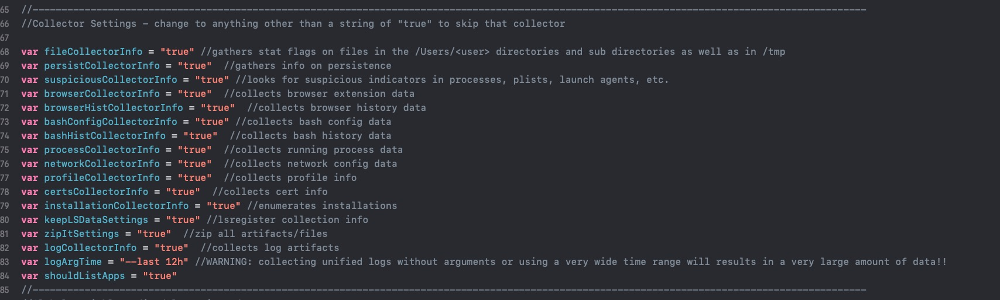
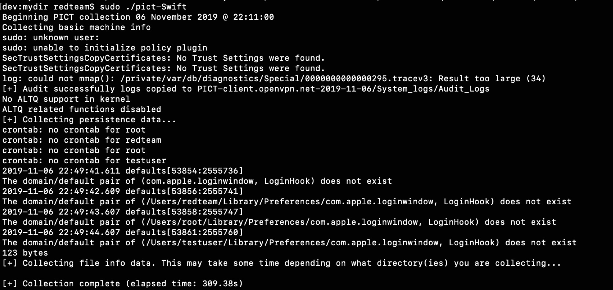

# PICT-Swift (Post Infection Collection Toolkit)

This is a Swift (and slightly modified) version of Thomas Reed's PICT (Post Infection Collection Toolkit: https://github.com/thomasareed/pict). Thomas Reed is the brains behind the awesome PICT concept. I just simply wrote a Swift version of it and added an additional collector.

I wanted to port PICT over to Swift to have another option in case there is a need to run PICT on a macOS host that does not have python (which could be the case down the road once Apple removes scripting runtime engines from macOS).

**Info**

As noted in Thomas Reed's PICT README, PICT should be run on a live host that you suspect is infected with malware. PICT will then attempt to gather useful artifacts:
- persistence information
- search for suspicious indicators
- browser extensions
- browser history
- bash config info
- bash history info
- running process info
- network config info
- profile info
- cert info
- installations on the host
- log artifacts
-[NEW ADDITION I ADDED]: info listing on running apps

**How To Use**

PICT-Swift builds a mach-o binary that you can run on suspected infected macOS hosts. I have tested specifically on Mojave and Catalina hosts. You can either use the binary included in this github repo (file named *"pict-Swift-compiled"* in this repo) or you can edit the code/configs and build a new binary from Xcode. If you choose to edit the settings, each collector setting is located at the top of the main.swift source code as seen below:

 

To do so, simply download the repo, open the xcodeproj file, edit the main.swift source code, and build to drop a new compiled binary. Once you have your binary (or if you use the included compiled binary in this repo), you will need to take the following steps on the suspected infected macOS host for the mach-o binary to have permissions to run:

_**First give the mach-o binary full hard disk access which will be needed for some artifacts:**_
1. Open System Preferences -> Security & Privacy
2. Click the Privacy tab
3. on the Left panel, scroll down and select "Full Disk Access"
4. Click the "+" button and then add your pict-swift mach-o binary

_**Second:**_

Ensure all browsers are closed and not running so that history data can be accessed.

_**Third:**_

run the pict-Swift mach-o binary with sudo privileges so that the binary has permissions to collect the necessary artifacts

**How pict-Swift works**:

The pict-swift mach-o binary will create a new directory in the current working directory with the structure _"PICT-[hostname]-YYYY-MM-DD"_. This is the directory that pict-Swift will dump artifacts and data gathered. Also, once done swift-PICT will zip all artifacts and data gathered into a file named _"pict.zip"_ that you can copy and take offline for deeper analysis.

Below is an example of the pict-swift mach-o binary running. As written, I have all of the collectors enabled by default, so the included compiled binary *"pict-Swift-compiled"* in this repo will have all collection options enabled. This will likely take about 10+ mins to complete depending on the size of the /Users and /tmp directories on the target, which pict-swift will enumerate through and document st_flags for. 

 
